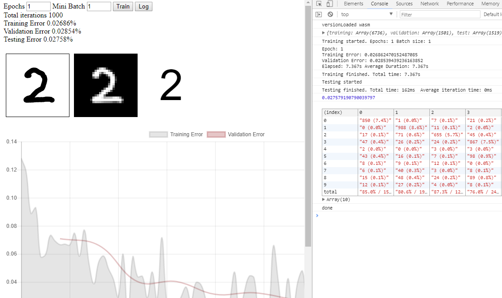

jsNet
=
[](https://travis-ci.org/DanRuta/jsNet)&nbsp;&nbsp;&nbsp;&nbsp;JS: [](https://coveralls.io/github/DanRuta/jsNet?branch=master) C++: [](https://codecov.io/gh/DanRuta/jsNet)
---

[](https://nodei.co/npm/jsnet/)

jsNet is a browser/nodejs based deep learning framework for MLPs and convolutional neural networks.

*Disclaimer: I am the sole developer on this, and I'm learning things as I go along. There may be things I've misunderstood, not done quite right, or done outright wrong. If you notice something wrong, please let me know, and I'll fix it (or submit a PR).*


## Table of Contents
- [Demos](#demos)
- [Loading](#loading)
    - [As an NPM package](#as-an-npm-package)
    - [Manual nodejs](#manually-loading---nodejs)
    - [Manual browser](#manually-loading---browser)
- [Constructing](#constructing)
    - [InputLayer](#inputlayer)
- [Training](#training)
    - [Validation](#validation)
    - [Early stopping](#early-stopping)
    - [Mini batch size](#mini-batch-size)
    - [Shuffle](#shuffle)
- [Testing](#testing)
- [Confusion Matrix](#confusion-matrix)
- [Exporting](#exporting)
- [Importing](#importing)
- [Configurations](#configurations)
    - [Network](#network)
        - [Weight update function](#weight-update-functions)
        - [Activation function](#activation-function)
        - [Regularization](#regularization)
        - [Weights Initialization](#weights-initialization)
    - [FCLayer](#fclayer-fully-connected-layer)
    - [ConvLayer](#convlayer-convolutional-layer)
    - [PoolLayer](#poollayer)
    - [NetUtil](#netutil)
- [Future plans](#future-plans)
- [Contributing](#contributing)
---

## Demos
https://ai.danruta.co.uk/mnist - Interactive MNIST Digit classifier, using FCLayers only.

https://ai.danruta.co.uk/webassembly - Performance comparison between JS and WebAssembly (v2.0) versions.

`examples/mnist` - Development environment set up for the MNIST data set (serve via included nodejs server)




##  Loading
---
There are two different versions of jsNet: WebAssembly, and JavaScript-only. There are demos included in the `examples` folder for loading both versions, in nodejs, as well as in the browser. The WebAssembly version is a little more complex to load, due to the NetWASM files which are generated by emscripten, containing the compiled code and the glue code to manage the WASM code. The ```NetWASM.js``` lazy loads the ```NetWASM.wasm``` file with the given path.

The API has been kept the same as the JavaScript only version. Every single value has get/set bindings to the WebAssembly variables, meaning that apart from not being able to freely browse the values in dev tools (need to call them, to see them), you should notice no API difference between the two versions. One thing to note is that when changing primitive WebAssembly array values, eg, setting `net.layers[1].neurons[0].weights[0]` to 1, you need to set the entire, modified weights array, not at an index. For example, you would do this instead:
```javascript
const weights = net.layers[1].neurons[0].weights
weights[0] = 1
net.layers[1].neurons[0].weights = weights
```

Note that you need to serve files via a server (a basic server is an included) to load WebAssembly into a browser.

### As an NPM package
To install jsNet, run ```npm install jsNet```. You can choose which version you want to use at runtime. When ```require```-ing the package, you need to call the appropriate version, like so:

#### JavaScript
```javascript
const {Network, FCLayer} = require("jsNet").js()
```

#### WebAssembly
```javascript
const {Module, Network, FCLayer} = require("jsNet").webassembly()
```
When loading the WebAssembly version, you also need to use the Module object. This is the compiled emscripten WebAssembly object which binds your code to the C++ code. If you change the file structure, read below on how to load manually.

Once loaded, write your code inside the ```global.onWASMLoaded``` function which gets called when the ```.wasm``` file is loaded.

```javascript
global.onWASMLoaded = () => { /* ready */ }
```

### Manually loading - Nodejs
The below files can be found in the ```dist``` folder.

#### JavaScript
Depending on where your jsNet file is, you do the same as above, but with a different path
```javascript
const {Network, FCLayer} = require("./dist/jsNet.js").js()
```
If you don't need the WebAssembly version, you can just import the JavaScript version directly
```javascript
const {Network, FCLayer} = require("./dist/jsNetJS.min.js")
```

#### WebAssembly
Again, depending on where your files are, you need the following:
```javascript
const {Module, Network, FCLayer} = require("./dist/jsNet.js").webassembly("./path/to/NetWASM.wasm")
```
**NOTE** that if not using the npm package, you need to specify the path to the NetWASM.wasm file. When using the npm package, the path defaults to ```./node_modules/jsnet/dist/NetWASM.wasm```, so you need to change this appropriately.

If you don't need to pick the version at runtime, you can load the WebAssembly version directly. Once loaded, write your code inside the ```global.onWASMLoaded``` function which gets called when the ```.wasm``` file is loaded.

```javascript
global.jsNetWASMPath = "./dist/NetWASM.wasm"
const {Network, FCLayer} = require("./dist/jsNetWebAssembly.min.js")
const Module = require("./dist/NetWASM.js")

global.onWASMLoaded = () => { /* ready */ }
```


### Manually loading - Browser

#### JavaScript
To load the JavaScript version, you need only the ```jsNetJS.min.js``` file.
```html
<script src="dist/jsNetJS.min.js"></script>
```
#### WebAssembly
To load the WebAssembly version, you need the following two files.
```html
<script src="dist/jsNetWebAssembly.min.js"></script>
<script src="dist/NetWASM.js"></script>
```

You will need to handle the request path of the ```.wasm``` file in your server code (check the included file, for an example).

If you are unable to change server code, you can set the path in your html file, like so, instead:
```html
<script src="dist/jsNetWebAssembly.min.js"></script>
<script>
    global.jsNetWASMPath = "./dist/NetWASM.wasm"
</script>
<script src="dist/NetWASM.js"></script>
```

Once loaded, you need to listen for the ```jsNetWASMLoaded``` event, which is fired when the ```.wasm``` file is loaded:
```javascript
"use strict"
window.addEventListener("jsNetWASMLoaded", () => { /* ready */ })
```


### Constructing
---
When everything is loaded, if using WebAssembly, you need to assign the module when creating the network, like so:
```javascript
const net = new Network({Module: Module})
```
I will use [the MNIST dataset](https://github.com/cazala/mnist) in the examples below.

```javascript
const {Network, Layer, FCLayer, ConvLayer, PoolLayer, Filter, Neuron, NetMath, NetUtil} = require("jsNet").js()
// Get just what you need.
```
Layer is an alias for FCLayer, for people not using the library for convolutional networks.

A network can be built in three different ways:

##### 1
With absolutely no parameters, and it will build a 3 FCLayer net. It will figure out some appropriate sizes for them once you pass it some data.
```javascript
const net = new Network()

// WebAssembly
const net = new Network({Module: Module})
// This config must always be included when using the  WebAssembly version
```
##### 2
By giving a list of numbers, and the network will configure some FCLayers with that many neurons.
```javascript
const net = new Network({
    layers: [784, 100, 10]
})
```

##### 3
Or you can fully configure the layers by constructing them. Check below what configurations are available for each layer.
```javascript
// Example 1 - fully connected network
const net = new Network({
    layers: [new InputLayer(784), new Layer(100), new Layer(10)]
})
// Example 2 - convolutional network
const net = new Network({
    layers: [new FCLayer(784), new ConvLayer(8, {filterSize: 3}), new PoolLayer(2), new FCLayer(196), new FCLayer(10)]
})
```

##### InputLayer
The input data can be either a one dimensional array, or a volume (3D array). To define the input layer, you can configure the InputLayer with

The input layer can be defined with either an FCLayer, or an InputLayer. The InputLayer can be configured either with the number of total inputs, or as the number of filters, with the filter spans, like so:
```javascript
const inputA = new InputLayer(10) // For 10 input items
const inputB = new InputLayer(3, {span: 5}) // For 75 input items
```

The usual arrangement of layers would folow something like this:

```InputLayer -> [ConvLayer]* -> [ConvLayer* -> PoolLayer*]* -> FCLayer+```

In words, an InputLayer, optionally followed by pairs of Conv and (optional) Pool layers (starting with Conv), and at the end, at least one FCLayer.
The first FCLayer needs to have as many neurons in it as there are data points per iteration, and the last FCLayer needs to have as many neurons as there are classes for your data set.

When building a convolutional network, make sure that the number of neurons in the FC layer following a Conv or Pool layer matches the number of outgoing activations in the layer preceding it. See below for a tip on easily calculating that number.

### Training
----

The data structure must be an object with key ```input``` having an array of numbers, and key ```expected```  holding the expected output of the network. For example, the following is a valid input for training, validation and testing.
```javascript
{input: [1,0,0.2], expected: [1, 2]}
```
***Tip**: You can normalize 1D data using the ```NetUtil.normalize()``` function ([see at the bottom](#normalizedata))*

Alternativelty, when using volume data, the following is also a valid input:
```javascript
{input: [ [[0.1,0.2],[0.3,0.4]], [[0.5,0.6],[0.7,0.8]] ], expected: [1, 2]}
```
You train the network by passing a set of data. The network will log to the console the error and epoch number, after each epoch, as well as time elapsed and average epoch duration.
```javascript
const {training} = mnist.set(800, 200) // Get the training data from the mnist library, linked above

const net = new Network()
net.train(training) // This on its own is enough
.then(() => console.log("done")) // Training resolves a promise, meaning you can add further code here (eg testing)
```

Softmax is used by default during training, on the last layer (unless there is only one value). As such, activation configurations are not used there.

##### Options
###### Epochs
By default, this is ```1``` and represents how many times the data passed will be used.
```javascript
net.train(training, {epochs: 5}) // This will run through the training data 5 times
```
###### Callback
You can also provide a callback in the options parameter, which will get called after each iteration (Maybe updating a graph?). The callback is passed how many iterations have passed, the milliseconds elapsed since training started, and the validation error OR the training error with input data for that iteration.
```javascript
const doSomeStuff = ({iterations, trainingError, validationError, elapsed, input}) => ....
net.train(training, {callback: doSomeStuff})
```
###### Callback Interval
The number of iterations between callbacks can be configured via the `callbackInterval` config. By default, it is set to 1, meaning the callback is called with each iteration. By turning it to 5, for example, callbacks are called only every 5 iterations.

***Tip**: Setting the interval to a number slightly above 1 can **greatly** improve the network speed, especially the WebAssembly version, where callbacks greatly slow down training.

Example:
```javascript
net.train(training, {callback: doSomeStuff, callbackInterval: 1}) // Every iteration
net.train(training, {callback: doSomeStuff, callbackInterval: 5}) // Every 5 iterations, but considerably quicker
```

###### Log
You can turn off the logging by passing log: false in the options parameter.
```javascript
net.train(training, {log: false})
```

###### Validation
You can specify an array of data to use as validation. This must have the same structure as the training/test data. The validation config contains three parts: data, interval, and early stopping (see below). The data is where the data is provided. The interval is an integer, representing how many training iterations pass between validations of the entire validation set. By default, this is set to 1 epoch, aka the length of the given training data set.
```javascript
// Validate every 5 training iterations
net.train(training, {validation: {
    data: [...],
    interval: 5
}})
// Validate every 3 epochs
net.train(training, {validation: {
    data: [...],
    interval: training.length * 3
}})
```
**Tip**: You can use ```NetUtil.splitData(data)``` to split a large array of data into training, validation, and test arrays, with default or specified ratios. See the NetUtil section at the bottom.

###### Early stopping
When using validation data, you can specify an extra config object, `earlyStopping`, to configure stopping the training early, once a condition has been met, to counter overfitting. By default, this is turned off, but each option has default values, once the type is specified, via the `type` key.

|  Type | What it does | Available Configurations | Default value |
|:-------------:| :-----:| :-----:| :---: |
| threshold | Stops the training the first time the validation error reaches, or goes below the specified threshold. A final backward pass is made, and weights updated, before stopping. | threshold.  | 0.01 |
| patience | This backs up the weights and biases of the network when the validation error reaches a new best low, following which, if the validation error is worse, a certain number of times in a row, it stops the training and reverts the network weights and biases to the backed up values. The number of times in a row to tolerate is configured via the `patience` hyperparameter | patience | 20 |
| divergence | This backs up the weights and biases of the network when the validation error reaches a new best low, following which, if the validation error is worse, by at least a percent value equal to that specified, it stops the training and reverts the network weights and biases to the backed up values. The percentage is configured via the `percent` hyperparameter. A very jittery validation error is likely to stop the training very early, when using this condition. | percent | 30 |

Examples:
```javascript
// Threshold - Training stops once the validation error reaches down to at most 0.2
net.train(training, {validation: {
    data: [...],
    earlyStopping: {
        type: "threshold",
        threshold: 0.2
    }
}})
// Patience - Training stops once the validation error is worse than the best found, 20 times in a row
net.train(training, {validation: {
    data: [...],
    earlyStopping: {
        type: "patience",
        patience: 10
    }
}})
// Divergence - Training stops once the validation error is worse than the best found, by 30%
net.train(training, {validation: {
    data: [...],
    earlyStopping: {
        type: "divergence",
        percent: 30
    }
}})
```

###### Mini Batch Size
You can use mini batch SGD training by specifying a mini batch size to use (changing it from the default, 1). You can set it to true, and it will default to how many classifications there are in the training data.

```javascript
net.train(training, {miniBatchSize: 10})
```

###### Shuffle
You can randomly shuffle the training data before it is used by setting the shuffle option to true
```javascript
net.train(training, {shuffle: true})
```

### Testing
---
Once the network is trained, you can test it like so:
```javascript
const {training, test} = mnist.set(800, 200)
net.train(training).then(() => net.test(test))
```
This resolves a promise, with the average test error percentage.

##### Options
###### Log
You can turn off the logging by passing log: false in the options parameter.
```javascript
const {training, test} = mnist.set(800, 200)
net.train(training).then(() => net.test(test, {log: false}))
```
###### Callback
Like with training, you can provide a callback for testing, which will get called after each iteration. The callback is passed how many iterations have passed, the error, the milliseconds elapsed and the input data for that iteration.
```javascript
const doSomeStuff = ({iterations, error, elapsed, input}) => ....
net.train(training).then(() => net.test(test, {callback: doSomeStuff}))
```
### Confusion matrix

Confusion matrices can be generated for each training, validation, and testing, as well as merged. The raw data for each can be accessed as either `net.trainingConfusionMatrix`, `net.testConfusionMatrix`, or `net.validationConfusionMatrix`. The matrix can be printed out using `net.printConfusionMatrix(type)`, where the type is any of `"training"`, `"test"`, or `"validation"`. If no type is given, the data for all 3 is summed up.

When calling the function in nodejs, the chart is printed out in the terminal. When called in the browser, it is printed in the console as a table.


To access the computed data yourself, including the percentages, without the printing, you can call `NetUtil.makeConfusionMatrix(net.trainingConfusionMatrix)`, `NetUtil.makeConfusionMatrix(net.testConfusionMatrix)`, or `NetUtil.makeConfusionMatrix(net.validationConfusionMatrix)`, which will return a JSON version of the printed data.

### Exporting
---
There are two way you can manage your data. The built in way is to use JSON for importing and exporting. If you provide my IMGArrays library (https://github.com/DanRuta/IMGArrays), you can alternatively use images, which are much quicker and easier to use, when using the browser.

To export weights data as JSON:
```javascript
const data = trainedNet.toJSON()
```

See the IMGArrays library documentation for more details, and nodejs instructions, but its integration into jsNet is as follows:
```javascript
const canvas = trainedNet.toIMG(IMGArrays, opts)
IMGArrays.downloadImage(canvas)
```

### Importing
---
Only the weights are exported. You still need to build the net with the same structure and configs, eg activation function. Again, data can be imported as either JSON or an image, when using IMGArrays, like above.

When using json:
```javascript
const freshNetwork = new Network(...)
freshNetwork.fromJSON(data)
```
If using exported data from before version 2.0.0, just do a find-replace of "neurons" -> "weights" on the exported data and it will work with the new version.

When using IMGArrays:
```javascript
const freshNetwork = new Network(...)
freshNetwork.fromIMG(document.querySelector("img"), IMGArrays, opts)
```

As an example you could run, you can use the image below to load data for the following jsNet configuration, to have a basic model trained on MNIST.
```javascript
const net = new Network({
    layers: [new FCLayer(784), new FCLayer(100), new FCLayer(10)]
})
net.fromIMG(document.querySelector("img"), IMGArrays)
```


### Trained usage
---
Once the network has been trained, tested and imported into your page, you can use it via the ```forward``` function.
```javascript
const userInput = [1,0,1,0,0.5] // Example input
const netResult = net.forward(userInput)
```
This will return an array of the **softmax** activations in the output layer, when there are multiple output values.


## Configurations
---
**String configs are case/space/underscore insensitive.**

Without setting any configs, the default values are equivalent to the following configuration:
```javascript
const net = new Network()
// is equivalent to
const net = new Network({
    activation: "sigmoid",
    learningRate: 0.2,
    cost: "meansquarederror",
    dropout: 1,
    l2: undefined,
    l1: undefined,
    layers: [ /* 3 FCLayers */ ]
    updateFn: "vanillasgd",
    weightsConfig: {
        distribution: "xavieruniform"
    }
})
```

### Network

You can check the framework version via Network.version (static).

|  Attribute | What it does | Available Configurations | Default value |
|:-------------:| :-----:| :-----:| :---: |
| learningRate | The speed at which the net will learn. | Any number | 0.2 (see below for exceptions) |
| cost | Cost function to use when printing out the net error | crossEntropy, meanSquaredError, rootMeanSquaredError | meansquarederror |
| channels | Specifies the number of channels in the input data. EG, 3 for RGB images. Used by convolutional networks. | Any number | undefined |
| conv | (See ConvLayer) An object where the optional keys filterSize, zeroPadding and stride set values for all Conv layers to default to  | Object | {} |
| pool | (See PoolLayer) An object where the optional keys size and stride set values for all Pool layers to default to  | Object | {} |

##### Examples
```javascript
net = new Network({learningRate: 0.2})
net = new Network({cost: "crossEntropy"})
net = new Network({cost: (target, output) => ...})
convnet = new Network({
    layers: [...some fc, conv and pool layers ...],
    conv: {
        filterSize: 3,
        zeroPadding: 1,
        stride: 1
    },
    pool: {
        size: 2
    }
})
```

You can set custom cost functions. They are given the iteration's expected output as the first parameter and the actual output as the second parameter, and they need to return a single number.

Learning rate is 0.2 by default, except when using the following configurations:

| Modifier| Type | Default value|
|:-------------:| :-----: | :-----: |
| RMSProp | updateFn | 0.001 |
| adam | updateFn | 0.01 |
| adadelta | updateFn | undefined |
| tanh, lecuntanh | activation | 0.001 |
| relu, lrelu, rrelu, elu | activation | 0.01 |

### Weight update functions
|  Attribute | What it does | Available Configurations | Default value |
|:-------------:| :-----:| :-----:| :---: |
| updateFn | The function used for updating the weights/bias. The vanillasgd option just sets the network to update the weights without any changes to learning rate. | vanillasgd, gain, adagrad, RMSProp, adam , adadelta, momentum | vanillasgd |
| rmsDecay | The decay rate for RMSProp, when used | Any number | 0.99 |
| rho | Momentum for Adadelta, when used | Any number | 0.95 |
| momentum | Momentum for the (sgd) momentum update function. | Any number | 0.9 |

##### Examples
```javascript
net = new Network({updateFn: "adagrad"})
net = new Network({updateFn: "RMS_Prop", rmsDecay: 0.99})
net = new Network({updateFn: "adadelta", rho: 0.95})
```

### Activation Function
|  Attribute | What it does | Available Configurations | Default value |
|:-------------:| :-----:| :-----:| :---: |
| activation | Activation function used by neurons | sigmoid, tanh, relu, lrelu, rrelu, lecuntanh, elu | sigmoid |
| lreluSlope | Slope for lrelu, when used | Any number | -0.0005 |
| eluAlpha | Alpha value for elu, when used | Any number | 1 |

\* When constructing convolutional networks, one of the rectified linear unit activation functions may be more suitable.

##### Examples
```javascript
net = new Network({activation: "sigmoid"})
net = new Network({activation: "lrelu", lreluSlope: -0.0005})
net = new Network({activation: "elu", eluAlpha: 1})
net = new Network({activation: x => x})
```
You can set your own activation functions in the JavaScript version (but not the WebAssebly version). The functions are given as parameters:
- The sum of the previous layer's activations and the neuron's bias
- If the function should calculate the prime (during backprop) - boolean
- A reference to the neuron/filter being activated (in pool layers, the reference is to the net).

The network is bound as the function's scope, meaning you can access its data through ```this```.
The function needs to return a single number.

### Regularization
|  Attribute | What it does | Available Configurations | Default value |
|:-------------:| :-----:| :-----:| :---: |
| dropout | Probability a neuron will **not** be dropped | Any number, or false to disable (equivalent to 1) | 1 (disabled) |
| l2 | L2 regularization strength | any number, or true (which sets it to 0.001) | undefined |
| l1 | L1 regularization strength | any number, or true (which sets it to 0.005) | undefined |
| maxNorm | Max norm threshold | any number, or true (which sets it to 1000) | undefined |

##### Examples
```javascript
net = new Network({dropout: 0.5})
net = new Network({l1: 0.005})
net = new Network({l2: 0.001})
net = new Network({maxNorm: 1000})
```

You can do elastic net regularization by including both l1 and l2 regularization configs.

### Weights Initialization
You can specify configuration options for weights initialization via the weightsConfig object. The values below go in the weightsConfig object.

|  Attribute | What it does | Available Configurations | Default value |
|:-------------:| :-----:| :-----:| :---: |
| distribution | The distribution of the weights values in a neuron | uniform, gaussian, xavierNormal, lecunUniform, lecunNormal, xavierUniform | xavierUniform |
| limit | Used with uniform to dictate the maximum absolute value of the weight. 0 centered. | Any number | 0.1 |
| mean| Used with gaussian to dictate the center value of the middle of the bell curve distribution | Any number | 0 |
| stdDeviation | Used with gaussian to dictate the spread of the data. | Any number | 0.05 |

###### Xavier Normal
This samples weights from a gaussian distribution with variance: ``` 2 / (fanIn + fanOut)```

###### Xavier Uniform
This samples weights from a uniform distribution with limit: ``` sqrt(6 / (fanIn + fanOut)) ```

###### Lecun Normal
This samples weights from a gaussian distribution with variance: ``` 1 / fanIn```

###### Lecun Uniform
This samples weights from a uniform distribution with limit: ``` sqrt(3 / fanIn) ```

Xavier Normal/Uniform falls back to Lecun Normal/Uniform on the last layer, where there is no fanOut to use.

You can set custom weights distribution functions. They are given as parameters the number of weights needed and the weightsConfig object, additionally containing a layer's fanIn and/or fanOut. It must return an array of weights.

##### Examples
```javascript
net = new Network({weightsConfig: {
    distribution: "uniform",
    limit: 0.1
}})
net = new Network({weightsConfig: {
    distribution: "gaussian",
    mean: 0,
    stdDeviation: 1
}})
net = new Network({weightsConfig: {distribution: "xavierNormal"}})
net = new Network({weightsConfig: {distribution: "lecunUniform"}})
net = new Network({weightsConfig: {distribution: n => [...new Array(n)]}})
```

### FCLayer (Fully connected layer)
```FCLayer(int num_neurons[, object configs])```

The first parameter, an integer, is for how many neurons the layer will have. The second, is an object where the configurations below go.

|  Attribute | What it does | Available Configurations | Default value |
|:-------------:| :-----:| :-----:| :---: |
| activation | Activation function to use (see below notes) | false, sigmoid, tanh, relu, lrelu, rrelu, lecuntanh, elu, _function_ | The net's activation function |

##### Examples
```javascript
// 20 neurons, sigmoid activation function
net = new Network({
    activation: "sigmoid",
    layers: [..., new FCLayer(20), ...]
})
// 100 neurons, no activation function
net = new Network({
    activation: "sigmoid",
    layers: [..., new FCLayer(20, {activation: false}), ...]
})
// 15 neurons, tanh activation function
net = new Network({
    activation: "sigmoid",
    layers: [..., new FCLayer(20, {activation: "tanh"}), ...]
})
```

Softmax is used by default on the last layer. Activation configurations are therefore not used there.

### ConvLayer (Convolutional layer)
```ConvLayer(int num_filters[, object configs])```

The first parameter, an integer, is for how many filters to use in the layer. The second, is an object where the configurations below go.

|  Attribute | What it does | Available Configurations | Default value |
|:-------------:| :-----:| :-----:| :---: |
| filterSize | The spacial dimensions of each filter's weights. Giving 3 creates a 3x3 map in each channel | Any odd number | 3 |
| zeroPadding | How much to pad the input map with zero values. Default value keeps output map dimension the same as the input | Any positive integer | Rounded down filterSize/2, keeping dimensions the same (equivalent to 'SAME' in TensorFlow) |
| stride | How many values to move between convolutions | Any positive integer | 1 |
| activation | Activation function to use (see below notes) | false, sigmoid, tanh, relu, lrelu, rrelu, lecuntanh, elu, _function_ | false |

You need to make sure you configure the hyperparameters correctly (you'll be told if something's wrong), to have the filter convolve across all input values and avoiding otherwise decimal outgoing spacial dimensions.

### Tip
You can calculate the spacial dimensions of a convolution layer's outgoing activation volume with the following formula:
```
size out = (size in - filter size + 2 * zero padding) / stride + 1
```

#### About the activation function
Sometimes, you may read about ReLU layers being used, and such. However, it made much more sense in the implementation to just do the activation in the ConvLayer, as it would be more computationally efficient than using a dedicated layer. Therefore there are no such 'activation' layers, as you just specify the activation in the network configs.

By default, the Conv layer activation is turned off (similar to configuring with ```false```). However, you can configure it via the activation key. You can provide a custom function (in the JavaScript only version), or use the string name of an existing activation function, similar to configuring the network activation. (See above)

##### Examples
```javascript
net = new Network({
    activation: "relu",
    layers: [..., new ConvLayer(8, {filterSize: 3, activation: false}, ...)] // Conv layer will use no activation
})
net = new Network({
    activation: "relu",
    layers: [..., new ConvLayer(8, {zeroPadding: 0, stride: 2}), ....] // Conv layer will use ReLU activation
})
net = new Network({
    activation: "relu",
    layers: [..., new ConvLayer(8, {filterSize: 5, activation: "elu"}), ....] // Conv layer will use eLU
})
```

### PoolLayer
```PoolLayer(int span[, object configs])```

The first parameter, an integer, is for the size of area to pool across (Eg, 2, for a 2x2 area). The default value is 2.
The second is an object where the configurations below go.

|  Attribute | What it does | Available Configurations | Default value |
|:-------------:| :-----:| :-----:| :---: |
| stride | How many values to move between pooling | Any number | layer.size |
| activation | Activation function to use (see below notes) | false, sigmoid, tanh, relu, lrelu, rrelu, lecuntanh, elu, function | false |

The pooling operation used is max pool.

##### Examples

```javascript
net = new Network({
    layers: [
        new FCLayer(784), // 28 x 28
        new ConvLayer(8, {filterSize: 3, zeroPadding: 1, stride: 1}), // 28 x 28
        new PoolLayer(2, {stride: 2}), // 14 x 14
        new FCLayer(196),
        new FCLayer(50),
        new FCLayer(10)
    ],
    activation: "lrelu",
    updateFn: "adagrad",
    learningRate: 0.05
})
```

### Tip
When using Pool layers following a convolutional layer, it is more computationally efficient to perform the activation function in the pool layer instead of doing it in the conv layer. This is only true for increasing functions (the included activation functions are ok). The logic behind it is that max pooling will pick the highest value out of a set of values. It makes sense to only compute the activation of a single value instead of a group of them, as the pooling choice would not be affected by an increasing function.

For example, using the following set-up compared to the one above, the training was about 18% (average of 4) faster (with nearly identical results). This optimization may be even more dramatic for Pool layers with bigger sizes.
```javascript
net = new Network({
    layers: [
        new FCLayer(784),
        new ConvLayer(8, {filterSize: 3, zeroPadding: 1, stride: 1, activation: false}), // !
        new PoolLayer(2, {stride: 2, activation: "lrelu"}), // !
        new FCLayer(196),
        new FCLayer(50),
        new FCLayer(10)
    ],
    activation: "lrelu",
    updateFn: "adagrad",
    learningRate: 0.05
})
```
### NetUtil
There is a NetUtil class included, containing some potentially useful functions.

### shuffle(data)
_array_ **data** - The data array to shuffle

This randomly shuffles an array _in place_ (aka, data passed by reference, the parameter passed will be changed).
##### Example
```javascript
const data = [1,2,3,4,5]
NetUtil.shuffle(data)
// data != [1,2,3,4,5]
```

### splitData(data), splitData(data, {training=0.7, validation=0.15, test=0.15})
_array_ **data** - The data array to split
_object_ configs: Override values for the ratios to split. The values should add up to 1.

This is used for splitting a large array of data into the different parts needed for training.
##### Example
```javascript
const data = [1,2,3,4,5]
const {training, validation, test} = NetUtil.splitData(data)
// or
const {training, validation, test} = NetUtil.splitData(data, {training: 0.5, validation: 0.25, test: 0.25})
```

### normalize(data)
_array_ **data** - The data array to normalize

This normalizes an array of positive and/or negative numbers to a [0-1] range. The data is changed in place, similar to the shuffle function.
##### Example
```javascript
const data = [1,2,3,-5,0.4,2]
const {minValue, maxValue} = NetUtil.normalize(data)
// data == [0.75, 0.875, 1, 0, 0.675, 0.875]
// minValue == -5
// maxValue == 3
```

## Future plans
---
More and more features will be added, as time goes by, and I learn more. General improvements and optimizations will be added throughout. Breaking changes will be documented. Check the changelog to see the history of added features.

##### Short term
Next up are some general framework improvements, in 3.2, following which, the WebGL version, in 4.0. You can keep track of progress on the dev branch.

##### Long term
A WebAssembly+WebGL version, using shaders to run computations on the GPU.

## Contributing
---
I am always looking for feedback, suggestions and ideas, especially if something's not right, or it can be improved/optimized.

Pull requests are always welcome. Just make sure the tests all pass and coverage is at (or nearly) at 100%.
To develop, first ```npm install``` the dev dependencies. You can then run ```grunt``` to listen for file changes and run transpilation + bundling.

You can run:
- ```npm run js-tests``` to run the mocha tests for the JavaScript version, and see the coverage.
- ```npm run wa-tests``` to run the mocha tests for the JavaScript part of the WebAssembly version, and see the coverage.
- (from msys, or similar, if using Windows) ```npm run cpp-tests``` to run the Google Test tests for the C++ part of the WebAssembly version


To build the WebAssembly version, you will need to be able to use emscripten to compile locally. Check out [this article](https://medium.com/statuscode/setting-up-the-ultimate-webassembly-c-workflow-6484efa3e162) I wrote if you need any help setting it up. Once set up, run ```npm run build``` to set up the environment. Grunt will do the compilation during development.
